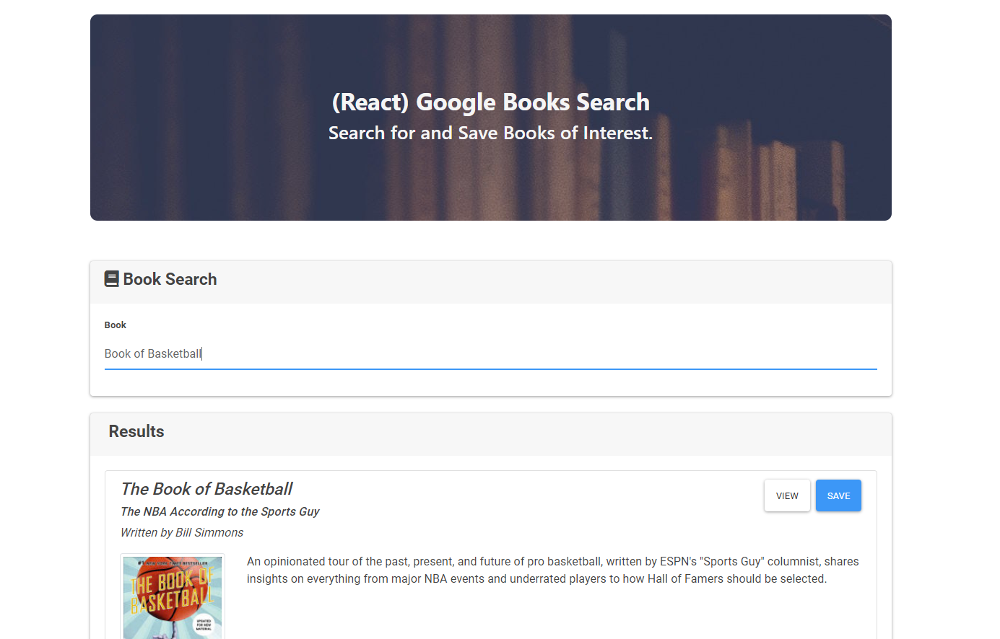

# React Book Search
This is an application using the google book search API to find a list of books
which you can save for later viewing.

## Technology
This application uses the MERN stack with a MongoDB, Express, React, and Node.

## Live Site
To See the live site check out:
[React Book Search on Heroku](https://react-books-kg.herokuapp.com/)
